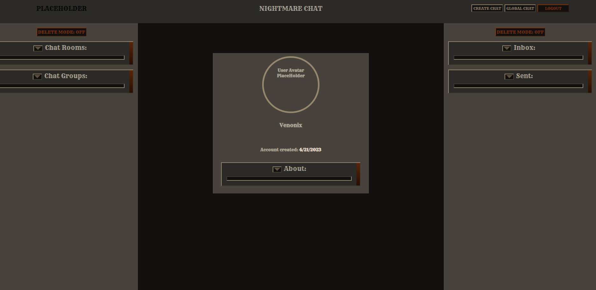

# Nightmare-Chat

### Getting Started:
  [Launch the app!](https://nightmare-chat.herokuapp.com/)
  <br/><br/>
  Login and navigate to the user page! *It already does that for you, so you have no choice...*
  There you can edit your profile! No one can see it yet though, so it is only for your own amusement.
  Click on the global chat button to chat! It is a bit touchy, sometimes it renders real time, someimes it requires a refresh after the page loads. But hey, it is just proof of concept, it will be better optimized in the future... When I get around to fixing it.

### Resources:
*TECHNOLOGIES:*
<br/>


<br/>*LANGUAGES:*<br/> 


<br/>*PROGRAMS:*<br/>


<br/>*HOSTING:*<br/> 


<br/>*OTHER:*<br/> 
[](https://github.com)
[](https://https://npmjs.com/)
<br/>Resource Links:<br/>
| [ERD](https://lucid.app/documents/view/4c34b76a-0f2b-4bff-87a4-d2eec348bd6a) |-----| [Wire Frames](https://whimsical.com/nightmarechat-gd1PKZ6Nmv124EbqKih5k) |-----| [Trello](https://trello.com/b/qTQSLPOP/nightmarechat) |<br/>
### Description:
This project became a nightmare... For me. (In all seriousness, I will be changing this when I actually have a decent app.
<br/>**CODE BLOCKS:**
<details>
This was pretty cool:
  
```
    return (
        <div className='FormPage-container'>
          <h3>{type === 'CRM' ? 'CHATROOM' : 'GROUP CHAT'} CREATE FORM</h3>
          <form autoComplete='off' onSubmit={handleSubmit} className='FormPage-form'>
          <button onClick={toggleType} type='button' disabled={true}>
            {type === 'CRM' ? 'CREATE a Group Chat?' : 'CREATE a Chatroom?'}
          </button>
            <div className='FormPage-form-spacer'>
              <div className='FormPage-sub-container'>
                <label>{ type === 'CRM' ? 'Chatroom' : 'Group Chat'} Name: </label>
                <input type='text' name='name'
                  value={formData.name}
                  minLength='3' maxLength='64'
                  onChange={handleChange}
                  placeholder={'Chat Name'}
                  required
                />
                <label>Description: </label>
                <input className='input-textarea' id='FormPage-textarea'
                  type='textarea' name='description'
                  minLength='1' maxLength='3000'
                  rows='15' cols='75'
                  onChange={handleChange} required
                  value={formData.description}
                />
              </div>
              <div className='FormPage-sub-container'>
                <label>Send Invites: </label>
                { formData.invites.length === 0 ?
                  <FormSearchComponent servicePackage={{ type, act: 'NEW', limit: type === 'CRM' ? 29 : 9}} 
                    formData={formData} setFormData={setFormData} user={user} 
                  />
                :
                <ul className='search-list'>
                  {formData.invites.map((inv, idx) =>     
                    <li className={ idx % 2 === 0 ? 's-list-item-1' : 's-list-item-2'} key={idx}>
                        <p>{inv.avatar}</p>
                        <p>{inv.name}</p>
                    </li>
                  )}
                </ul>
                }
              </div>
```
I did not like this:
  
```
io.on('connection', (socket) => {

    socket.on('enter-global', async function () {
        const global = await globalCtrl.fetchGlobal();
        console.log(`User ${socket.user.name} has connected to global at [${socket.id}]!`);
        socket.join('NIGHTMARE');
        io.to('NIGHTMARE').emit('update-global', global);
    });

    socket.on('send-global', async function({msg}) {
        const global = await globalCtrl.msgGlobal(msg);
        if (!global) return;
        socket.join('NIGHTMARE');
        io.to('NIGHTMARE').emit('update-global', global);
    });
```
</details>
<br />
  
### Screenshots:
<details><summary>Auth Page</summary>

</details>
<details><summary>User Page</summary>

</details>
<details><summary>Global Chat Page</summary>

</details><br/>

### Roadmap:

There is much more to learn before I consider properly planning out future features.
